# Tutorial: Generación de Documentación API con Doxygen

**Fecha:** 12 de junio de 2025  
**Autores:**  
- Karen Guatumillo  
- Patricio Jiménez  
- Hamilton Jumbo  
- Alex Lizano  
- Josué López  
- Oscar Ramírez  

**Versión:** 1.0  

## Índice
1. [Introducción](#introducción)
2. [Requisitos Previos](#requisitos-previos)
3. [Instalación de Doxygen](#instalación-de-doxygen)
4. [Configuración del Proyecto](#configuración-del-proyecto)
5. [Documentación del Código Java](#documentación-del-código-java)
6. [Generación de la Documentación](#generación-de-la-documentación)
7. [Personalización y Mejoras](#personalización-y-mejoras)
8. [Resultados y Verificación](#resultados-y-verificación)
9. [Conclusiones](#conclusiones)

## Introducción

Doxygen es una herramienta de documentación ampliamente utilizada que puede generar documentación automáticamente a partir de código fuente anotado. Aunque originalmente fue diseñada para C++, también soporta otros lenguajes incluyendo Java.

Este tutorial te guiará paso a paso para generar documentación API profesional para proyectos Java usando Doxygen.

## Requisitos Previos

Antes de comenzar, asegúrate de tener:

- **Java JDK 8+** instalado
- **Proyecto Java** con código fuente (Spring Boot recomendado)
- **Sistema operativo:** Windows, macOS o Linux
- **Acceso a internet** para descargar Doxygen

## Instalación de Doxygen

### Windows
1. Descarga Doxygen desde la página oficial: [https://www.doxygen.nl/download.html](https://www.doxygen.nl/download.html)
2. Ejecuta el instalador y sigue las instrucciones
3. Verifica la instalación abriendo cmd y ejecutando:
```bash
doxygen --version
```

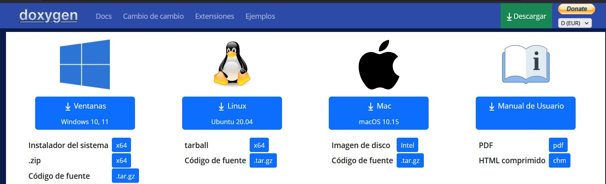

*Figura 1. Página oficial de Doxygen con opción de descarga para Windows.*


*Figura 2. Instalador de Doxygen mostrando el asistente de instalación.*

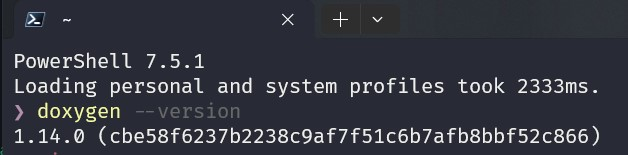

*Figura 3. Verificación de instalación de Doxygen desde consola (cmd).*


### macOS
```bash
# Usando Homebrew
brew install doxygen

# Usando MacPorts
sudo port install doxygen
```

### Linux (Ubuntu/Debian)
```bash
sudo apt-get update
sudo apt-get install doxygen
```

## Configuración del Proyecto

### Paso 1: Crear el archivo de configuración Doxygen

En la raíz de tu proyecto Java, ejecuta:
```bash
doxygen -g Doxyfile
```

Este comando genera un archivo `Doxyfile` con la configuración por defecto.

### Paso 2: Configurar el Doxyfile

Abre el archivo `Doxyfile` y modifica las siguientes líneas clave:

```bash
# Nombre del proyecto
PROJECT_NAME           = "Blog API Documentation"

# Versión del proyecto
PROJECT_NUMBER         = "1.4"

# Breve descripción
PROJECT_BRIEF          = "API REST para sistema de blog con Spring Boot"

# Directorio de código fuente
INPUT                  = ./src/main/java

# Recursivo para subdirectorios
RECURSIVE              = YES

# Extraer documentación de todos los elementos
EXTRACT_ALL            = YES

# Extraer miembros privados
EXTRACT_PRIVATE        = YES

# Extraer miembros estáticos
EXTRACT_STATIC         = YES

# Generar documentación HTML
GENERATE_HTML          = YES

# Directorio de salida HTML
HTML_OUTPUT            = docs/html

# Generar gráficos de herencia
HAVE_DOT               = YES
CLASS_DIAGRAMS         = YES

# Incluir código fuente
SOURCE_BROWSER         = YES

# Generar índice alfabético
ALPHABETICAL_INDEX     = YES

# Optimizar para Java
OPTIMIZE_OUTPUT_JAVA   = YES
```


*Figura 4. Archivo Doxyfile editado con las configuraciones personalizadas.*


## Documentación del Código Java

### Sintaxis de Comentarios Javadoc para Doxygen

Doxygen reconoce los comentarios estilo Javadoc. Aquí tienes ejemplos prácticos:

#### Ejemplo 1: Documentación de Clase

```java
/**
 * Entidad que representa una etiqueta (tag) en el sistema de blog.
 * 
 * <p>Las etiquetas permiten categorizar y organizar los posts del blog.
 * Extiende de UserDateAudit para incluir campos de auditoría automáticos.</p>
 * 
 * @author Hamilton Jumbo
 * @since 1.0
 * @version 1.4
 * @created 12 de junio de 2025
 */
@Entity
@Table(name = "tags")
public class Tag extends UserDateAudit {
    // ...
}
```


*Figura 5. Comentario Javadoc aplicado a una clase del proyecto.*


#### Ejemplo 2: Documentación de Atributos

```java
/**
 * ID único generado automáticamente para la etiqueta
 * 
 * <p>Estrategia: Generación por identidad de base de datos</p>
 */
@Id
@GeneratedValue(strategy = GenerationType.IDENTITY)
private Long id;

/**
 * Lista de posts asociados a esta etiqueta (relación ManyToMany)
 * 
 * <p>Configuración de la relación:
 * <ul>
 *   <li>Carga ansiosa (FetchType.EAGER)</li>
 *   <li>Tabla intermedia: post_tag</li>
 *   <li>Ignorado en serialización JSON (@JsonIgnore)</li>
 * </ul>
 * </p>
 * 
 * @see Post
 */
@JsonIgnore
@ManyToMany(fetch = FetchType.EAGER)
private List<Post> posts;
```

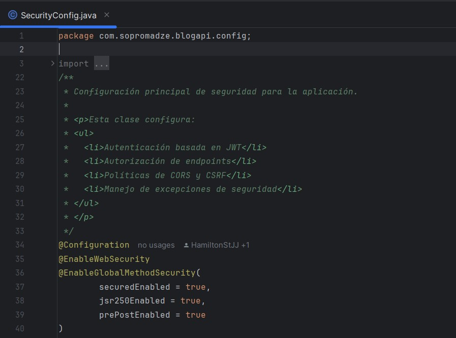

*Figura 6. Comentarios Javadoc aplicados a atributos de la clase Tag.*


#### Ejemplo 3: Documentación de Métodos

```java
/**
 * Obtiene una copia defensiva de la lista de posts asociados
 * 
 * <p>Retorna una nueva ArrayList para evitar modificaciones
 * externas no controladas de la colección interna.</p>
 * 
 * @return Una nueva lista con los posts asociados, o null si no hay posts
 * @throws IllegalStateException si la entidad no está inicializada
 * @see java.util.ArrayList
 * @since 1.0
 */
public List<Post> getPosts() {
    return posts == null ? null : new ArrayList<>(posts);
}
```

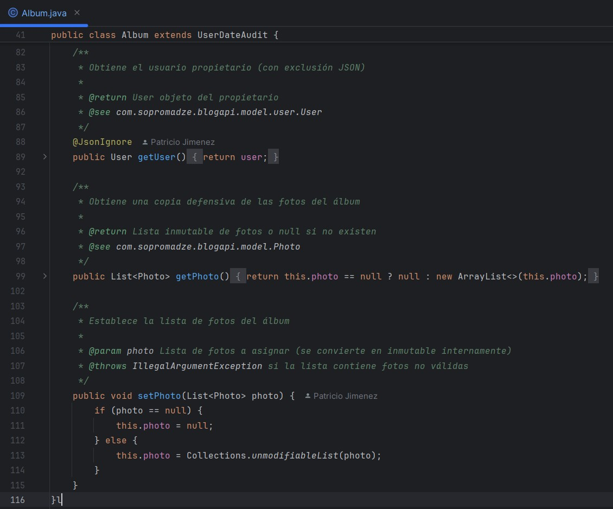

*Figura 7. Comentario Javadoc aplicado a un método que retorna una lista de posts.*


### Tags Javadoc Importantes

| Tag | Descripción | Ejemplo |
|-----|-------------|---------|
| `@param` | Documenta parámetros | `@param name Nombre de la etiqueta` |
| `@return` | Documenta valor de retorno | `@return Lista de posts asociados` |
| `@throws` | Documenta excepciones | `@throws IllegalArgumentException si name es null` |
| `@see` | Referencias cruzadas | `@see com.example.Post` |
| `@since` | Versión desde la cual existe | `@since 1.0` |
| `@author` | Autor del código | `@author Hamilton Jumbo` |
| `@version` | Versión actual | `@version 1.4` |
| `@deprecated` | Marca como obsoleto | `@deprecated Usar getPostsSecure() en su lugar` |

## Generación de la Documentación

### Paso 1: Ejecutar Doxygen

En el directorio raíz del proyecto, ejecuta:
```bash
doxygen Doxyfile
```

### Paso 2: Verificar la Generación

Si todo va bien, verás una salida similar a:
```
Searching for include files...
Searching for example files...
Searching for images...
Searching for dot files...
Searching for msc files...
Searching for dia files...
Searching for files to exclude...
Reading and parsing tag files
Parsing files
Building group list...
Building directory list...
Building namespace list...
Building file list...
Building class list...
Associating documentation with classes...
Computing nesting relations for classes...
Building example list...
Searching for enumerations...
Searching for documented typedefs...
Searching for members imported via using declarations...
Searching for included using directives...
Searching for documented variables...
Building interface member list...
Building member list...
Searching for friends...
Searching for documented defines...
Computing class inheritance relations...
Computing class usage relations...
Flushing cached template relations that have become invalid...
Computing class relations...
Add enum values to enums...
Searching for member function documentation...
Creating members for template instances...
Building page list...
Search for main page...
Computing page relations...
Determining the scope of groups...
Sorting lists...
Freeing entry tree
Determining which enums are documented
Computing member relations...
Building full member lists recursively...
Adding members to member groups.
Computing member references...
Inheriting documentation...
Generating disk names...
Adding source references...
Adding xrefitems...
Sorting member lists...
Computing dependencies between directories...
Generating citations page...
Counting data structures...
Resolving user defined references...
Finding anchors and sections in the documentation...
Transferring function references...
Combining using relations...
Adding members to index pages...
Generating style sheet...
Generating search indices...
Generating example documentation...
Generating file sources...
Generating file documentation...
Generating docs for file src/main/java/com/example/model/Tag.java...
Generating page documentation...
Generating group documentation...
Generating class documentation...
Generating docs for compound Tag...
Generating namespace index...
Generating graph info page...
Generating directory documentation...
Generating index page...
Generating page index...
Generating module index...
Generating namespace index...
Generating namespace member index...
Generating annotated compound index...
Generating alphabetical compound index...
Generating hierarchical class index...
Generating member index...
Generating file index...
Generating file member index...
Generating example index...
finalizing index lists...
writing tag file...
Running dot...
Generating dot graphs using 4 parallel threads...
Running dot for graph 1/2
Running dot for graph 2/2
Patching output file 1/2
Patching output file 2/2
lookup cache used 45/65536 hits=234 misses=45
finished...
```

 

*Figura 8. Consola mostrando el proceso exitoso de generación de documentación.*


### Paso 3: Acceder a la Documentación

La documentación HTML se genera en el directorio especificado (por defecto `docs/html`). 
Abre el archivo `index.html` en tu navegador web.

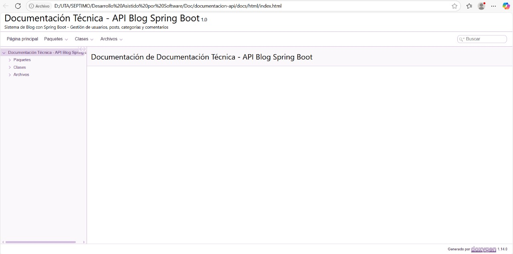  

*Figura 9. Vista general de la documentación generada automáticamente por Doxygen en formato HTML.*

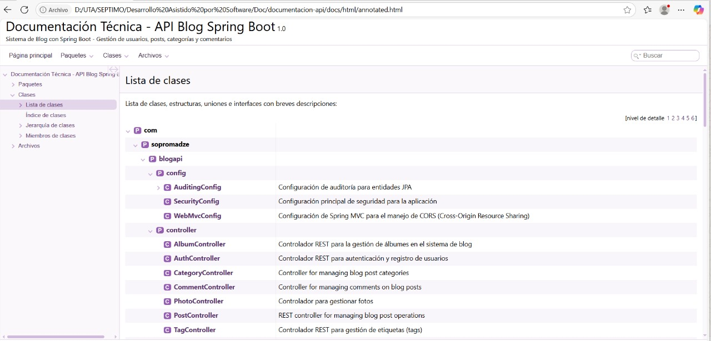  

*Figura 10. Vista general de la documentación generada automáticamente por Doxygen en formato HTML.*

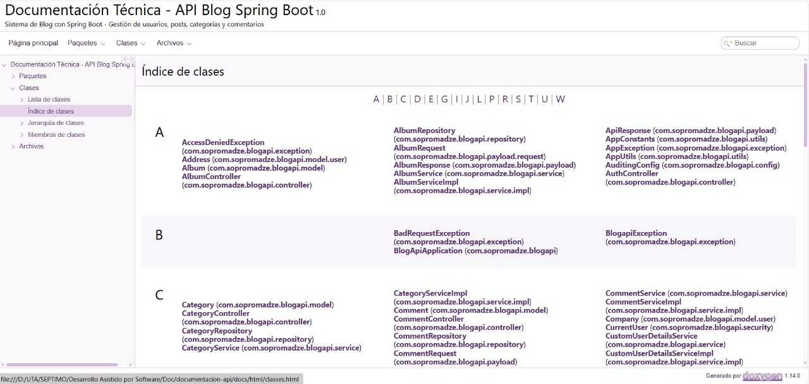  

*Figura 11. Vista general de la documentación generada automáticamente por Doxygen en formato HTML.*

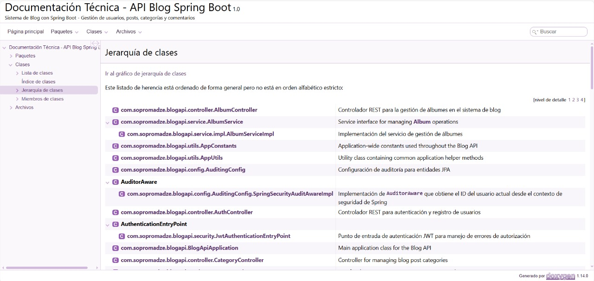  

*Figura 12. Vista general de la documentación generada automáticamente por Doxygen en formato HTML.*

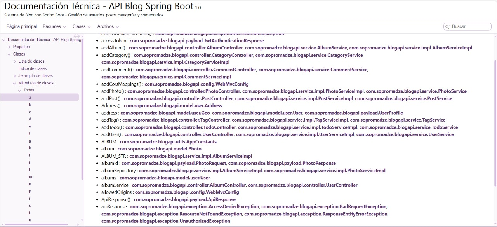  

*Figura 13. Vista general de la documentación generada automáticamente por Doxygen en formato HTML.*

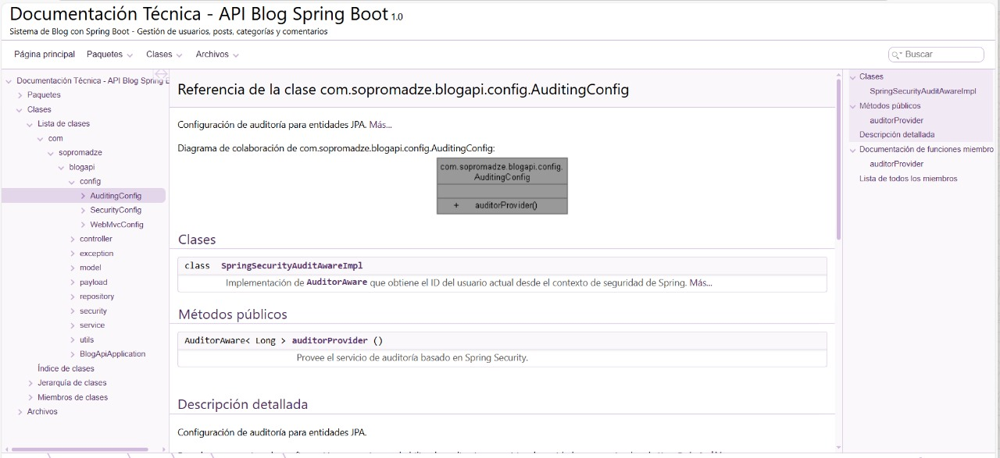  

*Figura 14. Vista general de la documentación generada automáticamente por Doxygen en formato HTML.*

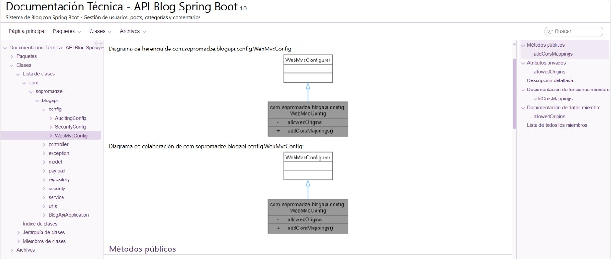  

*Figura 15. Vista general de la documentación generada automáticamente por Doxygen en formato HTML.*

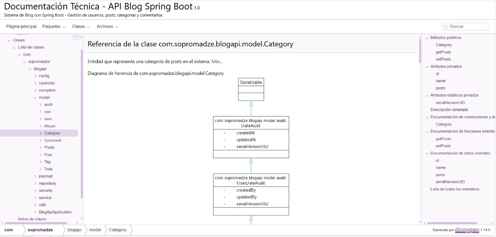  

*Figura 16. Vista general de la documentación generada automáticamente por Doxygen en formato HTML.*


## Personalización y Mejoras

### Personalizar el Estilo HTML

Puedes modificar la apariencia editando estas opciones en el `Doxyfile`:

```bash
# Usar hoja de estilos personalizada
HTML_STYLESHEET        = custom.css

# Header personalizado
HTML_HEADER           = header.html

# Footer personalizado  
HTML_FOOTER           = footer.html

# Logo del proyecto
PROJECT_LOGO          = logo.png
```

### Generar Diagramas UML

Para generar diagramas de clases, asegúrate de tener Graphviz instalado:

```bash
# Windows (usando Chocolatey)
choco install graphviz

# macOS
brew install graphviz

# Linux
sudo apt-get install graphviz
```

Luego habilita en el `Doxyfile`:
```bash
HAVE_DOT               = YES
CLASS_DIAGRAMS         = YES
COLLABORATION_GRAPH    = YES
GROUP_GRAPHS           = YES
INCLUDE_GRAPH          = YES
INCLUDED_BY_GRAPH      = YES
CALL_GRAPH             = YES
CALLER_GRAPH           = YES
```

### Configurar Temas

Para un tema más moderno, puedes usar:
```bash
GENERATE_TREEVIEW      = YES
DISABLE_INDEX          = NO
FULL_SIDEBAR           = NO
HTML_COLORSTYLE_HUE    = 220
HTML_COLORSTYLE_SAT    = 100
HTML_COLORSTYLE_GAMMA  = 80
```

## Resultados y Verificación

### Estructura de Archivos Generados

Después de ejecutar Doxygen, tu estructura de proyecto se verá así:

```
proyecto/
├── src/
│   └── main/
│       └── java/
│           └── com/
│               └── example/
│                   └── model/
│                       ├── Tag.java
│                       ├── Photo.java
│                       └── Post.java
├── docs/
│   └── html/
│       ├── index.html          # Página principal
│       ├── classes.html        # Lista de clases
│       ├── files.html          # Lista de archivos
│       ├── functions.html      # Índice de funciones
│       ├── search/             # Funcionalidad de búsqueda
│       ├── classTag.html       # Documentación de la clase Tag
│       └── ...
├── Doxyfile                    # Archivo de configuración
└── README.md
```

### Verificar la Calidad de la Documentación

1. **Navegación:** Verifica que puedes navegar entre clases
2. **Herencia:** Comprueba que se muestran las relaciones de herencia
3. **Enlaces:** Asegúrate de que los `@see` funcionan correctamente
4. **Código fuente:** Verifica que el código fuente es accesible
5. **Búsqueda:** Prueba la funcionalidad de búsqueda
6. **Diagramas:** Confirma que se generan los diagramas UML

### Ejemplo de Página Generada

La documentación para la clase `Tag` incluirá:

- **Descripción general** de la clase
- **Lista de atributos** con sus descripciones
- **Lista de métodos** con parámetros y valores de retorno
- **Diagrama de herencia** mostrando `UserDateAudit`
- **Diagrama de colaboración** mostrando relación con `Post`
- **Código fuente** con resaltado de sintaxis

## Automatización con Scripts

### Script para Windows (generate-docs.bat)

```batch
@echo off
echo Generando documentacion API...
doxygen Doxyfile
if %ERRORLEVEL% EQU 0 (
    echo Documentacion generada exitosamente en docs/html/
    start docs/html/index.html
) else (
    echo Error al generar la documentacion
)
pause
```

### Script para Linux/macOS (generate-docs.sh)

```bash
#!/bin/bash
echo "Generando documentación API..."
doxygen Doxyfile

if [ $? -eq 0 ]; then
    echo "Documentación generada exitosamente en docs/html/"
    # Abrir en navegador por defecto
    if [[ "$OSTYPE" == "darwin"* ]]; then
        open docs/html/index.html
    else
        xdg-open docs/html/index.html
    fi
else
    echo "Error al generar la documentación"
    exit 1
fi
```

## Integración con Maven

Para integrar Doxygen en el ciclo de vida de Maven, agrega este plugin al `pom.xml`:

```xml
<plugin>
    <groupId>org.codehaus.mojo</groupId>
    <artifactId>exec-maven-plugin</artifactId>
    <version>3.1.0</version>
    <executions>
        <execution>
            <id>generate-docs</id>
            <phase>site</phase>
            <goals>
                <goal>exec</goal>
            </goals>
            <configuration>
                <executable>doxygen</executable>
                <arguments>
                    <argument>Doxyfile</argument>
                </arguments>
            </configuration>
        </execution>
    </executions>
</plugin>
```

Luego ejecuta:
```bash
mvn site
```

## Solución de Problemas Comunes

### Error: "doxygen: command not found"
**Solución:** Asegúrate de que Doxygen esté instalado y en el PATH del sistema.

### Error: "warning: no matching class member found"
**Solución:** Verifica que los nombres en `@see` coincidan exactamente con las clases existentes.

### Los diagramas no se generan
**Solución:** Instala Graphviz y configura `HAVE_DOT = YES` en el Doxyfile.

### Encoding de caracteres incorrectos
**Solución:** Añade al Doxyfile:
```bash
INPUT_ENCODING         = UTF-8
OUTPUT_LANGUAGE        = Spanish
```

## Conclusiones

Doxygen es una herramienta poderosa para generar documentación API profesional. Las ventajas principales incluyen:

### Beneficios
- **Automatización:** La documentación se genera automáticamente
- **Consistencia:** Formato uniforme en toda la documentación
- **Navegación:** Interfaces web con búsqueda y navegación intuitiva
- **Diagramas:** Generación automática de diagramas UML
- **Multiplataforma:** Funciona en Windows, macOS y Linux
- **Integración:** Se puede integrar en sistemas de CI/CD

### Recomendaciones
1. **Documenta consistentemente** todas las clases, métodos y atributos públicos
2. **Usa HTML** en los comentarios para mejor formateo
3. **Incluye ejemplos** de uso en los comentarios
4. **Actualiza regularmente** la documentación con el código
5. **Personaliza el estilo** para que coincida con la identidad de tu proyecto

### Próximos Pasos
- Explora la generación de documentación en otros formatos (LaTeX, RTF)
- Investiga plugins para IDEs que faciliten la escritura de Javadoc
- Considera la integración con sistemas de CI/CD para generación automática
- Evalúa otras herramientas como OpenAPI para documentación de APIs REST

**Fecha de finalización:** 12 de junio de 2025  
**Autores:**  
- Karen Guatumillo  
- Patricio Jiménez  
- Hamilton Jumbo  
- Alex Lizano  
- Josué López  
- Oscar Ramírez  

**Versión del tutorial:** 1.0